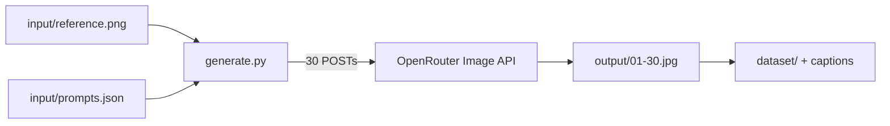

# Videogen — Identity Dataset Pipeline

Generate a 30-image identity dataset from one reference photo using [OpenRouter](https://openrouter.ai/) and **Nano Banana Pro** (`google/gemini-3-pro-image`), then export image + caption pairs for LoRA training.

## Overview

This project:

1. Sends **one reference image** plus **30 separate prompts** to OpenRouter's Image API
2. Saves generated images to `output/`
3. Optionally exports a LoRA-ready `dataset/` folder with paired `.txt` captions

Each prompt is a **separate API call**. The model does not receive all 30 shots in one request.



## Prerequisites

- Linux/macOS with `python3` available
- `ffmpeg` + `ffprobe` on PATH (for `./tools/video`)
- [OpenRouter API key](https://openrouter.ai/keys)
- A reference photo of the subject (`input/reference.png`)

## Project structure

```
videogen/
├── input/
│   ├── reference.png      # identity anchor (you provide)
│   └── prompts.json       # lock, 30 shots + LoRA captions
├── output/                # generated images + manifest (gitignored)
├── dataset/               # LoRA export (gitignored)
├── .env                   # OPENROUTER_API_KEY (gitignored)
├── generate.py            # batch image generation
├── export_dataset.py      # export images + caption .txt files
├── tools/                 # image + video prep (see tools/README.md)
│   ├── prep               # stills wrapper → prep.py
│   └── video              # ffmpeg wrapper → video.py
├── prepped/               # tools/prep output (gitignored)
├── run.sh                 # convenience runner (generate.py)
└── requirements.txt
```

## Setup

1. Copy the environment template and add your API key:

   ```bash
   cp .env.example .env
   # edit .env and set OPENROUTER_API_KEY
   ```

2. Place your reference image:

   ```
   input/reference.png
   ```

   PNG, JPEG, or WebP are supported.

3. Review or edit `input/prompts.json` (see [Prompt format](#prompt-format) below).

## Quick start

```bash
./run.sh
```

`run.sh` creates a virtualenv if needed, installs dependencies, and runs `generate.py`.

Equivalent manual run:

```bash
python3 -m venv .venv
source .venv/bin/activate
pip install -r requirements.txt
python generate.py
```

> **Note:** This system may not have a `python` command. Use `python3` or `./run.sh`.

## How generation works

### API

- **Endpoint:** `POST https://openrouter.ai/api/v1/images`
- **Model:** `google/gemini-3-pro-image` (Nano Banana Pro)
- **Defaults:** `resolution: 2K`, `aspect_ratio: 9:16` (used only if a shot omits `aspect_ratio`)

Each request sends:

```json
{
  "model": "google/gemini-3-pro-image",
  "prompt": "<shot>\n\n<identity lock>",
  "resolution": "2K",
  "aspect_ratio": "4:5",
  "input_references": [
    {
      "type": "image_url",
      "image_url": { "url": "data:image/png;base64,..." }
    }
  ]
}
```

The API response contains base64 image bytes:

```json
{
  "created": 1785141002,
  "data": [{ "b64_json": "...", "media_type": "image/jpeg" }],
  "usage": { "cost": 0.13651 }
}
```

### Prompt assembly

`prompts.json` merges two sections into one `prompt` string per shot (`shot` first, then `lock`):

| Section | Purpose |
|---------|---------|
| `shot` | Pose, camera, clothing, lighting, place for this image only |
| `lock` | Shared identity instructions (same on every call) |
| `rules` | Optional extra shared block (appended if present) |

The `caption` field is **not** sent to the API. It is used only for LoRA export.

### Concurrency

Up to 3 requests run in parallel by default (`--concurrency 3`). Each task tracks its own index, so responses are saved to the correct file regardless of completion order.

### Resume

If `output/01.jpg` already exists, that shot is skipped. Delete a bad image and re-run to regenerate only missing indices.

## Prompt format

`input/prompts.json` structure:

```json
{
  "trigger": "ohwx woman",
  "lock": "The supplied reference image is the identity anchor...",
  "shots": [
    {
      "id": "01",
      "title": "Straight-on",
      "aspect_ratio": "4:5",
      "shot": "A photograph of the same woman as the reference...",
      "caption": "head and shoulders, facing camera, light blue shirt, ..."
    }
  ]
}
```

| Field | Used for |
|-------|----------|
| `trigger` | LoRA caption prefix (e.g. `ohwx woman, ...`) |
| `lock` | Appended to every generation prompt |
| `rules` | Optional extra shared block |
| `shots[].shot` | Per-image generation instructions (sent first) |
| `shots[].caption` | Short LoRA caption: pose, clothes, light, place |
| `shots[].aspect_ratio` | Per-shot frame (`4:5` portraits, `9:16` full body) |

The included file has 30 shots:

- **01–10** — face portraits (`4:5`)
- **11–20** — waist / knees up (`4:5`)
- **21–30** — full body (`9:16`)

Outfits, hair wear, lighting, and expression rotate across shots so the LoRA does not bake in one shirt or one light. Captions name those variables.

Change `trigger` to your LoRA token before training.

## CLI reference

### `generate.py`

| Flag | Default | Description |
|------|---------|-------------|
| `--image` | `input/reference.png` | Reference photo |
| `--prompts` | `input/prompts.json` | Prompt config (`.json` or `.txt`) |
| `--out` | `output` | Output directory |
| `--model` | `google/gemini-3-pro-image` | OpenRouter model slug |
| `--resolution` | `2K` | `1K`, `2K`, or `4K` |
| `--aspect-ratio` | `9:16` | Fallback if a shot omits `aspect_ratio` |
| `--concurrency` | `3` | Parallel API requests |
| `--no-export-dataset` | off | Skip writing `dataset/` after generation |
| `--dataset-dir` | `dataset` | LoRA export directory |
| `--trigger` | from JSON | Override LoRA trigger token |

Examples:

```bash
./run.sh
./run.sh --no-export-dataset
./run.sh --aspect-ratio 1:1 --concurrency 1
./run.sh --trigger "sks woman"
```

### `export_dataset.py`

Re-export after manual QC (delete bad images from `output/` first):

```bash
.venv/bin/python export_dataset.py
.venv/bin/python export_dataset.py --manifest output/manifest.json --out dataset
```

Writes paired files:

```
dataset/
  01.jpg
  01.txt    →  ohwx woman, straight-on portrait, head and shoulders, ...
  02.jpg
  02.txt
  ...
```

### Image and video prep

Stills and clips live under `tools/`. Wrappers use the same `.venv` as `./run.sh`.

```bash
./tools/prep --help
./tools/video --help
```

Full command tables, presets, and pipelines: [`tools/README.md`](tools/README.md).

## Output files

### `output/`

| File | Description |
|------|-------------|
| `01.jpg` … `30.jpg` | Generated images |
| `manifest.json` | Per-shot metadata: index, shot_id, prompt, caption, cost, status |

### `manifest.json` entry

```json
{
  "index": 1,
  "shot_id": "01",
  "title": "Straight-on",
  "caption": "straight-on portrait, head and shoulders, ...",
  "trigger": "ohwx woman",
  "prompt": "<full merged prompt>",
  "file": "01.jpg",
  "status": "ok",
  "cost": 0.13651,
  "error": null
}
```

Status values: `ok`, `skipped` (file already existed), `error`.

## End-to-end workflow

### 1. Generate

```bash
./run.sh
```

### 2. Quality check

Review every image in `output/`. Remove failures:

- wrong identity (doesn't match reference)
- wrong pose or framing
- bad hands, anatomy, or heavy artifacts

Delete bad files (e.g. `rm output/07.jpg`) and re-run `./run.sh` to regenerate only missing shots.

### 3. Export dataset

If you QC'd manually without re-running generation:

```bash
.venv/bin/python export_dataset.py
```

### 4. Train LoRA

Point your trainer (Kohya, sd-scripts, etc.) at `dataset/`.

Tips:

- Keep the trigger token consistent across all captions
- Captions describe what's in the image, not generation instructions
- Start with low epochs; watch for overfitting
- Identity stays locked; captions should name changing clothes, light, and pose

### 5. Validate

Generate with your trigger token and test poses not in the dataset.

## Troubleshooting

| Problem | Fix |
|---------|-----|
| `python: command not found` | Use `./run.sh` or `python3` |
| `ffmpeg` / `ffprobe` missing | Install ffmpeg; needed for `./tools/video` |
| `OPENROUTER_API_KEY missing` | Set key in `.env` |
| `reference image not found` | Add `input/reference.png` |
| HTTP 429 / 502 | Automatic retries with backoff; lower `--concurrency` |
| Wrong aspect ratio | Set `shots[].aspect_ratio`, or pass `--aspect-ratio` as fallback |
| Partial run after crash | Re-run; existing images are skipped |
| Bad single image | Delete it from `output/`, re-run |

## Costs

Each image is one billed API call. Check `usage.cost` in `manifest.json` or your [OpenRouter dashboard](https://openrouter.ai/activity). Nano Banana Pro pricing varies by resolution.
